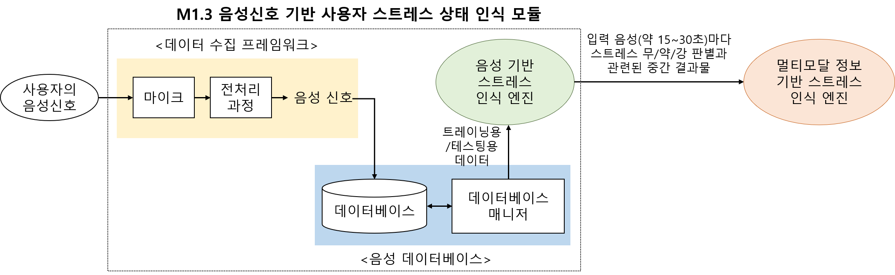
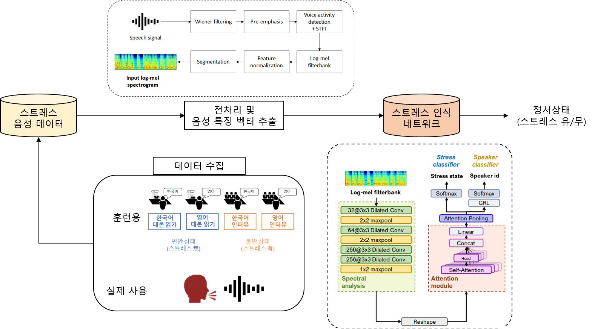
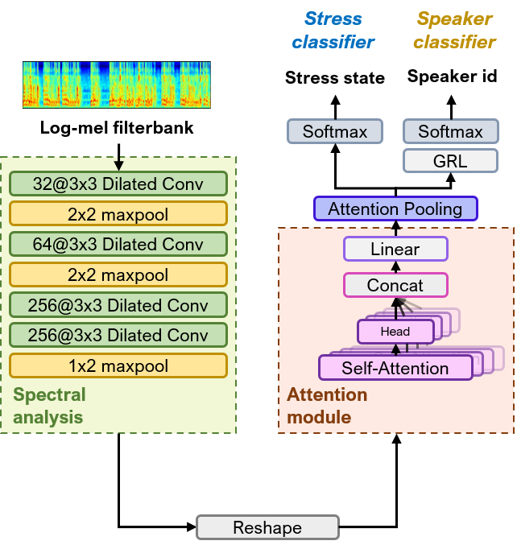
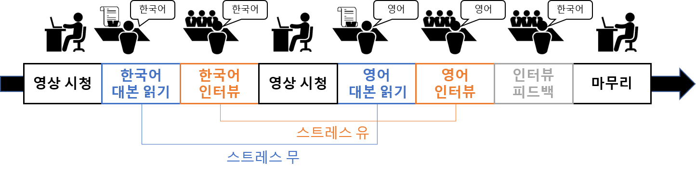

> * 버전: 0.1
> * 작성자: 한혜원
> * 히스토리: 
> * 2020/04/29, 초안작성 v1.0
> * 2020/05/30, 수정본작성 v1.1


***

#### Note

> * (2020/04/29) 5차년도 베이스라인코드 업로드
> * (2020/05/30) 5차년도 2차 베이스라인코드 업로드
> * (2020/07) 모델 수정 및 3차 베이스라인코드 업로드
> * (2020/10) 멀티모달 통합을 위한 3단계 인식 모델 업로드
> * (2020/11/02) 코드 수정
***

#### System/SW Overview


* 개발목표와 최종 결과물의 동작을 설명하고, 시스템/SW 대표 그림을 첨부한다. 
* 개발목표: 음성기반 스트레스 인식

> 
> 
***

#### 서버환경
* OS: Ubuntu 16.04
* Container : Nvidia-docker2
* GPU driver : 440.64
* CUDA: Nvidia CUDA 9.0
* CUDNN: 7.0.1

#### How to Install

```(bash)
pip install -r requirements.txt
```

***

#### Main requirement

> * python 3.5.2
> * tensorflow 1.9.0
> * keras 2.2.4

***

#### Network Architecture and features


> e.g.
> * **Model:**
> * **Embedding Layer:**
> * Consist of (dilated) CNN layers
> * CNN layer models both temporal and spectral information of mel-spectrogram to latent space
> * **Attention Layer:**
> * Self-attention model : the attention layer to capture informative frames.
> * **Classifier**
> * Softmax classifier that classifying the status (2 class mode: stress/nonstress, 3 class mode: strongly stressed / weakly stressed / neutral).
> * **Metrics:**
> * Accuracy for stress state
> * Extract 15 seconds of labeled speech from each speaker.

***

#### Quick start

> * Step0. python3 speech_server.py 실행
> * Step1. './demo' 내에 평가할 음성 파일 업로드
> * Step2. python3 speech_client.py 실행
> * Step3. 성공적으로 리턴이 되었는지 확인. 코드가 성공적으로 실행되었을 경우, 업로드한 wav파일에 대한 평가 결과가 json 형태로 리턴됨 
> * Step4. 다양한 파일의 평가를 위해서는 (공인평가용) evaluate.py 실행. 평가 후에는 ./result 폴더 내에 결과가 정리된 .csv파일들이 생성됨

#### Training Data
* 트레이닝 데이터에 대한 소개

> * 4차년도에 연세대학교에서 피험자 50명을 대상으로 수집한 멀티모달 데이터베이스 활용
> * 각 화자당 약 30분의 음성 파일을 수집 
> * 2단계: 스트레스 有: 한국어 스크립트 + 영어 스크립트 리딩  / 스트레스 無: 한국어 인터뷰 + 영어 인터뷰
> * 3단계: 스트레스 무: 한국어 스크립트  / 스트레스 약: 한국어 인터뷰 + 영어 스크립트 / 스트레스 강: 영어 인터뷰
> * 
***

#### Training Model

* Training from Scratch

> * Optimizer: Adam
> * Initial learning rate: 1e-4

***

#### Validation metrics calculation

* Leave-one-out subjective

***

#### HTTP-server API description

* **path, parameter, response를 명시한다.**

> *  /speech_server.py
> * JSON parameters are:

> |Parameter|Type|Description|
> |---|---|---|
> |filename|str|wav file path for evaluation

> * /speech_client.py
> * JSON parameters are:

> |Parameter|Type|Description|
> |---|---|---|
> |probability of state|float|Decision probability from {'neutral', 'stress'} classes.
> |state|int|Decision result from {'neutral', 'stress'} classes.

> * Request
> ```
> {
> filename: 'test.wav'
> }
> ```

> * Response OK
> ```
> <Response 200> success
> b'{
> '10001': 0.8,
> '10002': 0.2,
> }'
> ```

***

#### Repository overview

* 폴더 및 파일의 구조 및 역할(기능)을 설명한다.

> * ./templates/ : GUI를 위한 html 파일
> * ./demo/ -  수집한 음성 파일이 담긴 폴더
> * ./models : 훈련된 모델이 저장된 폴더
> * ./speech_server.py : Flask API server
> * ./speech_client.py : Flask API client에 해당 (**warning: 서버 실행 후 파일을 실행해야 함)
> * ./evaluate.py: 공인평가를 위한 평가 코드
> * ./result : 공인평가 이후 저장되는 결과 csv 파일
> * ./requirements.txt : 설치해야할 패키지 목록
> * ./utils/preprocessing.py: 음성파일 전처리 및 특징벡터 추출 모듈

***

#### configuration settings

해당사항 없음

***
